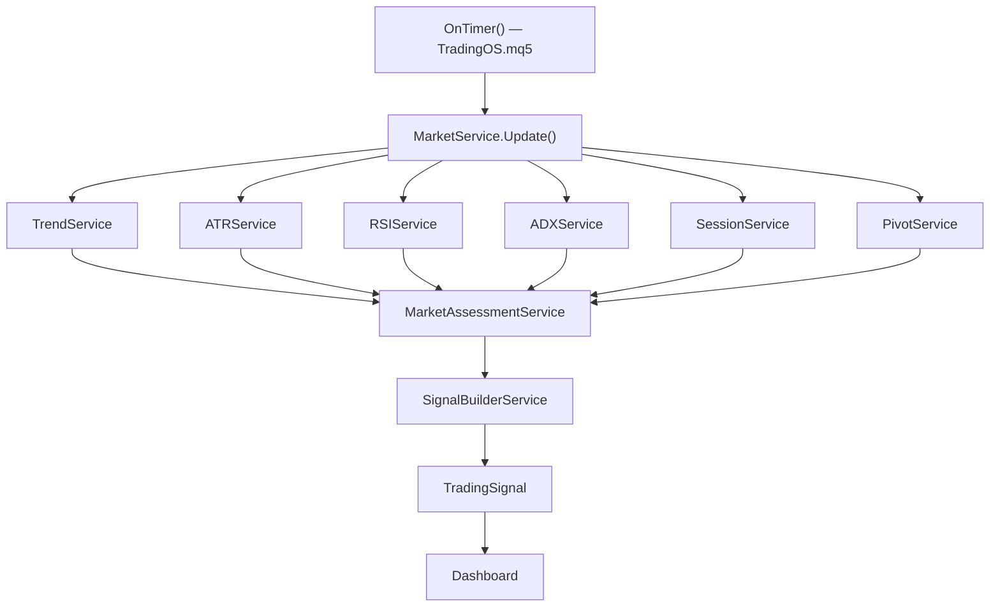

# System Flow and Transition Map

## Objetivo

Consolidar, num único documento de referência, três leituras que hoje existem espalhadas por vários documentos: o estado real do código (Legacy Baseline), a arquitetura-alvo de longo prazo (`ARCH-001`) e o fluxo normativo vigente da Release 1.0 (`RFC-007`, Alternativa B). Mapeia também quais componentes já existem em código, quais estão apenas especificados, e onde estão as lacunas de transição entre um estado e outro.

Este documento é **puramente consolidativo**: não introduz componente novo, não redefine contrato, não altera `ARCH-001`, `SPEC-001`, `SPEC-003`, nenhum ADR ou RFC já resolvida. Onde há divergência entre o que existe e o que está especificado, ela é apenas relatada — as resoluções já formalizadas (`ADR-015` a `ADR-018`, `RFC-006`/`RFC-007`) continuam sendo a referência normativa.

---

## Escopo

Cobre exclusivamente leitura e consolidação de fluxo/arquitetura já aprovados em outros documentos. Não decide nada novo. Onde este documento lista um componente como não implementado ou uma lacuna como aberta, isso já está registrado em `SPEC-001` (Component Lifecycle), `ROADMAP-006` ou `Docs/TECH_DEBT.md` — este documento apenas os reúne sob uma única lente de fluxo/transição.

---

# 1. Legacy Baseline (V1)

Congelada por `ADR-001`. Todo o código existente até 2026-07-21 compõe a Legacy Baseline — referência histórica, sem refatoração retroativa exigida (`ADR-001`, `ADR-002`).

## 1.1 Componentes reais (`MQL5/Include/TradingOS/`)

`TrendService`, `ATRService`, `RSIService`, `ADXService` (Indicators/), `SessionService`, `PivotService` (Analysis/Core), `MarketService`/`MarketAssessmentService`, `SignalBuilderService`, `Dashboard`/`PivotRenderer` (UI/), `Config` (`CConfig`), `Logger` (`CLogger`).

Código órfão congelado (Sprint 0.5, `Docs/TECH_DEBT.md` #1): `TrendAnalyzer`/`IAnalyzer` — não implementado (`Analyze()` é stub), não integrado, sem prazo de reativação antes da V1.

## 1.2 Fluxo real hoje

Todos os serviços de indicador (`TrendService`/`ATRService`/`RSIService`/`ADXService`) chamam `iMA`/`iATR`/`iRSI`/`iADX` diretamente, sem abstração de `Data Provider`/`Indicator Provider` isolada — mapeiam para `Indicator Provider` (`SPEC-001`, confirmado por `ADR-018` a partir de leitura direta do código), retornando valor técnico bruto, nunca `Evidence` formal (`DOMAIN-003`).

`MarketAssessmentService` aplica pesos e thresholds sobre esses valores, aproximando informalmente o papel de `Opportunity Service` + `Confidence Service`. `SignalBuilderService` aproxima `Decision Service`. Nenhum dos dois produz os tipos formais de `DOMAIN-001`/`DOMAIN-005` (`OpportunityId`, `DecisionId`, etc.).

`TradingSignal` é consumido diretamente pelo `Dashboard` — não há `Order Manager`, `Position Manager`, `Broker Adapter` ou `MT5 Adapter` na Legacy Baseline. **Nenhuma automação de envio de ordens existe hoje.** O sistema roda hoje como ferramenta de leitura de mercado (Dashboard), consistente com o escopo central do produto.

Gaps de qualidade documentados em `Docs/TECH_DEBT.md`: `PriceService.mqh` vazio, includes duplicados de `MarketContext.mqh`, convenção de nomenclatura quebrada no cluster órfão — nenhum bloqueante, todos congelados até V1.

---

# 2. Arquitetura-Alvo (`ARCH-001`)

Fluxo oficial de longo prazo, arquitetura-alvo para quando o Core Domain estiver implementado:

## 2.1 Bounded Contexts

| Bounded Context | Componentes | Origem |
|---|---|---|
| Core Domain | Evidence, Market Context, Opportunity, Decision | `ARCH-001` (congelado, `ADR-007`) |
| Infrastructure | Data Provider, Indicator Provider, Configuration Provider, Time Provider, Persistence Provider, Logger | `INFRA-001` a `003` |
| Strategy | Strategy Policy (único componente catalogado) | `RC-001` (Decisão A: permanece ativo) |
| Execution | Signal Builder, Order Manager, Position Manager, Broker Adapter, MT5 Adapter, Risk Service (gate operacional) | `EXEC-001` a `005` |
| Learning Domain | Knowledge Service, Learning Service | `ADR-010`, `DOMAIN-006`, `LEARN-001`/`002` |

`Core Domain` não depende de nenhuma camada inferior (Infrastructure, Execution, MT5, Broker, APIs, Rede, Banco de Dados). Infrastructure depende do domínio, nunca o contrário. Execution depende do domínio; o domínio não conhece Execution — `Opportunity` nunca atravessa o limite entre Core Domain e Execution; a entidade compartilhada é a `Decision` publicada, materializada como `Signal` pelo contexto de Execution.

---

# 3. Fluxo Normativo da Release 1.0 (`RFC-007`, Alternativa B)

`RFC-006`/`RFC-007` decidiram, no Post-Execution Architecture Review, que a Release 1.0 opera sob um pipeline mais curto que **não substitui nem revoga** `ARCH-001` — apenas define o escopo normativo de implementação desta release:

`Decision` é produzida diretamente a partir de indicadores (via o mecanismo já especificado em `EXEC-004`, reaproveitando a lógica da Legacy Baseline), sem passar por `Opportunity Service`/`Decision Service`/`Market Context Builder` formais. `Risk Service` opera como gate operacional pré-envio (`EXEC-003`), não como Domain Service de `SPEC-003`.

Justificativa da decisão (`RFC-007`): `ADR-009` estabeleceu a Primeira Execução como prioridade absoluta ("esta mudança aproxima ou afasta a Primeira Execução?"). A Alternativa A (`Indicators → Opportunity → Risk Service → Decision → Order Manager`, fiel a `ARCH-001`) exigiria implementar `Evidence Builder`, `Market Context Builder`, `Opportunity Service` e `Decision Service` do zero — hoje 0% implementados. A Alternativa B reaproveita a Legacy Baseline já compilando mais a camada `EXEC-001` a `EXEC-005` já inteiramente especificada.

`SPEC-003` (`Risk Service` como Core Domain Service, Entrada `Opportunity`/`Market Context`, Saída `Risk Profile`) **não é revogado** — permanece válido como parte da arquitetura-alvo de longo prazo (Alternativa A), para quando o Core Domain for implementado em release futura (`RFC-006`).

---

# 4. Componentes Implementados

Extraído do Component Lifecycle (`SPEC-001`) — status `Implemented`, sempre de forma informal na Legacy Baseline, sem a estrutura formal do modelo-alvo:

| Componente | Papel-alvo (`SPEC-001`) | Origem real (Legacy Baseline) |
|---|---|---|
| Evidence Builder | Core Domain Builder | `TrendService`/`ATRService`/`RSIService`/`ADXService`/`SessionService`/`PivotService` — sem `EvidenceId`/`Category`/`Weight` formais |
| Market Context Builder | Core Domain Builder | `struct MarketContext` — mutável, campos públicos, sem Aggregate Root imutável (`DOMAIN-004`) |
| Opportunity Service | Core Domain Service | `MarketAssessmentService` (pesos 0.5/0.3/0.2, thresholds ±20) — sem `Opportunity` formal (`DOMAIN-001`) |
| Decision Service | Core Domain Service | `SignalBuilderService` — sem `DecisionId`/`OpportunityId`/`ContextId` (`DOMAIN-005`) |
| Confidence Service | Core Domain Service | Embutido em `MarketAssessmentService` (`ConfidenceScore`/`ConfidenceLevel`) — não isolado |
| Data Provider | Infrastructure Provider | Chamadas diretas `iHigh`/`iLow`/`iClose` embutidas em `MarketService` |
| Indicator Provider | Infrastructure Provider | `TrendService`/`ATRService`/`RSIService`/`ADXService` chamando `iMA`/`iRSI`/`iATR`/`iADX` diretamente (mapeamento confirmado por `ADR-018`) |
| Configuration Provider | Infrastructure Provider | `CConfig` (`Config.mqh`) |
| Logger | Infrastructure Provider | `CLogger` (`Logger.mqh`) |
| Signal Builder | Execution Component | `CSignalBuilderService` (Sprint 6.4) |

---

# 5. Componentes Planejados (não implementados em código)

| Componente | Status (`SPEC-001`) | Especificação existente |
|---|---|---|
| Risk Service (Core Domain) | Planned | `SPEC-003` (contrato Opportunity/Market Context → Risk Profile) |
| Risk Service (gate operacional) | — (contrato próprio) | `EXEC-003` (Pre-Order Risk Gate) |
| Context Validation Policy | Planned | `SPEC-001` |
| Evidence Validation Policy | Planned | `SPEC-001` |
| Analyze/Validate/Evaluate/Generate/Publish (Application Services) | Planned | `SPEC-004` |
| Order Manager | Future | `EXEC-001` |
| Position Manager | Future | `EXEC-002` |
| Broker Adapter | Future | citado em `ARCH-001`/`INFRA-001`, sem documento próprio ainda |
| MT5 Adapter | Planned | `EXEC-005` |
| Time Provider | Future | citado em `SPEC-001`, sem documento próprio |
| Persistence Provider | Future | citado em `SPEC-001`, sem documento próprio |
| Strategy Policy | Planned | `SPEC-001` (único componente de Strategy catalogado) |
| Knowledge Service | Planned | `LEARN-001` |
| Learning Service | Planned | `LEARN-002` |

Toda a camada Execution (`EXEC-001` a `005`) está **100% especificada e 0% implementada em código** — a Release 1.0 roda hoje inteiramente sobre a Legacy Baseline, sem nenhum componente do modelo-alvo implementado.

---

# 6. Lacunas de Transição

- **Core Domain formal vs. Legacy Baseline informal**: nenhum dos componentes "Implemented" da Seção 4 produz os tipos formais do domínio (`Evidence`/`Opportunity`/`Decision`/`Market Context` com identidade, categoria, confiança, timestamp). Sem refatoração retroativa exigida (`ADR-001`/`ADR-002`) — migração incremental, apenas quando agregar valor funcional real.
- **Execution especificada, não implementada**: `EXEC-001` a `005` (Order Manager, Position Manager, Broker Adapter, MT5 Adapter, Signal Builder Execution-Layer, Risk Service gate) têm contrato completo, mas nenhum código. Nenhuma automação de ordens existe hoje — consistente com o escopo atual do produto, centrado em leitura de mercado e Dashboard.
- **`Risk Profile` sem contraparte em código**: `DOMAIN-007`/`ADR-015` formalizam `Risk Profile` como Value Object de `Opportunity`, mas `Opportunity` em si ainda não existe em código — `Risk Profile` é hoje um conceito apenas do modelo-alvo.
- **Candidatos deliberadamente adiados** (não são pendências, são decisões de escopo já formalizadas): `Event Dispatcher`/`Scheduler` (`ADR-016`); `Replay Adapter`, `CSV Provider`/`CSV Adapter`, `Mock Provider`, `REST Adapter`, `FIX Adapter`, `WebSocket Adapter` (`ADR-017`). Critério de reabertura: evidência de implementação (`ADR-009 §8`), nunca hipótese.
- **`ITEM-04`** (categoria `Execution` para `Evidence`, `ROADMAP-006`) é o único item do backlog ainda `Awaiting ADR`.
- **`ITEM-03`** (categoria `Risk` para `Evidence`) está `Approved`, pronto para aplicação direta, ainda não propagado a `DOMAIN-003`.
- **Strategy Bounded Context**: confirmado ativo (`RC-001`, Decisão A), mas apenas `Strategy Policy` está catalogado (status `Planned`) — nenhum componente implementado.
- **Learning Domain**: 5º Bounded Context (`ADR-010`), dois componentes catalogados (`Knowledge Service`/`Learning Service`, ambos `Planned`) — 0% implementado; `knowledge/` (raiz do repositório) ainda sem conteúdo.
- **Escopo do produto** (`VISION-001`/`REQ-001`, realinhamento em curso): o núcleo do TradingOS é leitura de mercado e geração de insights via Dashboard; automação de execução de ordens é evolução futura explícita, não uma lacuna a fechar com urgência — reenquadra a Seção 5 (Execution 0% implementada) como decisão de escopo, não atraso.

---

# Rastreabilidade

`ARCH-001` (arquitetura-alvo, Bounded Contexts) · `SPEC-001` (Component Lifecycle, status de cada componente) · `SPEC-003` (Domain Services, corrigido por `ADR-018`) · `ADR-001` (Legacy Baseline) · `ADR-007`/`ADR-009`/`ADR-012` (congelamentos e sequência de entrega) · `ADR-015` (`Risk Profile`, `DOMAIN-007`) · `ADR-016`/`ADR-017` (deferrals) · `ADR-018` (correção de mapeamento Legacy Indicator) · `RFC-006`/`RFC-007` (pipeline normativo da Release 1.0) · `INFRA-001` a `003` · `EXEC-001` a `005` · `ROADMAP-006` (backlog vigente) · `Docs/TECH_DEBT.md` (dívida técnica da Legacy Baseline) · `INVENTORY.md` (snapshot documental complementar).

---

# Alterações

**v1.0.0**: criação do documento. Consolida Legacy Baseline, arquitetura-alvo, pipeline normativo da Release 1.0 e mapa de transição entre os três, sem alterar nenhum documento-fonte.
