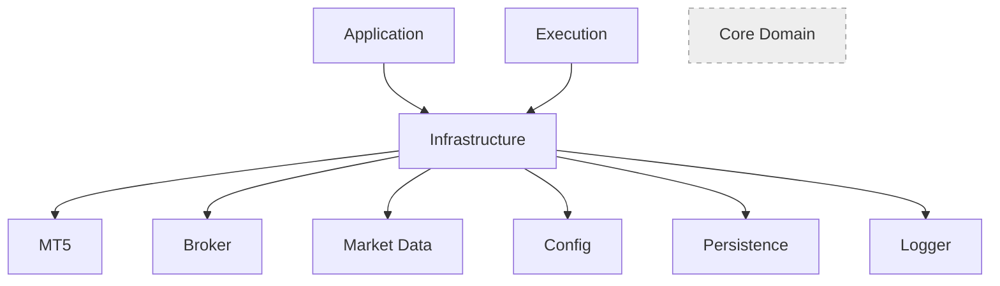

# Infrastructure Overview

Este documento inaugura oficialmente a **Fase 2 — Platform Foundation** do TradingOS.

A Architecture Baseline v1.0 está aprovada e congelada (ADR-007). Este documento **não altera** nenhum DOMAIN, ARCH, SPEC ou ADR — apenas detalha, dentro dos limites já definidos por `ARCH-001` e `SPEC-001`, a arquitetura da camada Infrastructure. Toda inconsistência identificada durante sua elaboração foi registrada como RFC, não corrigida ou inventada aqui (ver Seção "Rastreabilidade e Observações").

---

# Objetivo

Definir a arquitetura da camada de infraestrutura responsável por fornecer serviços técnicos ao Core Domain, à Application e à Execution, sem conter regras de negócio, decisões ou objetos de domínio.

---

# Escopo

Este documento descreve **exclusivamente** a camada Infrastructure, conforme delimitada em `ARCH-001`.

Infrastructure **NÃO contém**:

- regras de negócio;
- decisões;
- `Opportunity`;
- `Market Context`;
- `Evidence`;
- Domain Services.

Infrastructure apenas fornece serviços técnicos — dados, configuração, persistência, tempo, log e integração com sistemas externos — consumidos por outras camadas através dos contratos definidos em `SPEC-002`.

---

# Objetivos da Camada

## Responsabilidades

- Adquirir dados de mercado brutos (Data Provider).
- Produzir indicadores técnicos (Indicator Provider).
- Fornecer parâmetros de configuração (Configuration Provider).
- Persistir e recuperar dados quando necessário (Persistence Provider).
- Registrar eventos técnicos e de auditoria (Logger).
- Fornecer referência de tempo (Time Provider).
- Integrar com a plataforma de execução (Broker Adapter, MT5 Adapter).

## Limites

Infrastructure nunca decide. Ela apenas fornece informação bruta ou serviços técnicos para que Core Domain, Application e Execution decidam e ajam.

Infrastructure nunca constrói `Evidence`, `Market Context`, `Opportunity` ou `Decision` — isso é responsabilidade dos Core Domain Builders/Services (`SPEC-001`), que **consomem** Infrastructure através de Ports.

## Dependências

Infrastructure depende exclusivamente de serviços externos (MT5, APIs, Broker, Banco de Dados, Sistema de Arquivos, Rede) e das abstrações (Ports) definidas pelo domínio que ela implementa.

## Interfaces

Toda comunicação entre Infrastructure e as demais camadas ocorre através dos contratos já definidos em `SPEC-002-Interface-Contracts` (Data Provider, Indicator Provider — como consumidores de Evidence Builder). Este documento não define novos contratos.

## Fluxos

```
External Data
↓
Infrastructure
↓
Evidence Providers (consumidos pelo Core Domain via Ports)
```

Consistente com o "Arquitetura Geral" já definido em `ARCH-001`.

## Dependências Permitidas

- Infrastructure → External Services (MT5, APIs, Broker, Banco de Dados, Sistema de Arquivos, Rede).
- Application → Infrastructure (via Ports).
- Execution → Infrastructure (via Ports).
- Strategy → Infrastructure (via Ports), conforme `ARCH-001` ("Infrastructure ↓ Strategy ↓ Core Domain").

## Dependências Proibidas

- Core Domain → Infrastructure (nunca — `ARCH-001`: "O domínio não depende de infraestrutura").
- Infrastructure → Core Domain (Infrastructure não conhece `Opportunity`, `Market Context`, `Evidence` ou `Decision` como conceitos ativos — ela apenas fornece dados aos Builders que os constroem).
- Infrastructure → regras de negócio de qualquer tipo.

---

# Componentes

Visão geral apenas — responsabilidades, sem detalhamento de implementação. Cada componente será detalhado em uma entrega futura (INFRA-002 em diante).

| Componente | Responsabilidade |
|---|---|
| Data Provider | Disponibilizar dados brutos de mercado (Asset/Timeframe/Timestamp → Market Data Snapshot). Catalogado em SPEC-001 (Infrastructure Providers). |
| Indicator Provider | Produzir indicadores técnicos a partir de dados de mercado. Catalogado em SPEC-001 (Infrastructure Providers). |
| Configuration Provider | Fornecer parâmetros de configuração externalizados. Catalogado em SPEC-001 (Infrastructure Providers). |
| Persistence Provider | Persistir e recuperar dados quando necessário. Catalogado em SPEC-001 (Infrastructure Providers), status `Future`. |
| Logger | Registrar eventos técnicos e de auditoria. Catalogado em SPEC-001 (Infrastructure Providers) — ver observação de nomenclatura abaixo. |
| Time Provider | Fornecer referência de tempo ao domínio. Catalogado em SPEC-001 (Infrastructure Providers), status `Future`. |
| Broker Adapter | Integração com a corretora. Catalogado em SPEC-001 como Execution Component, não Infrastructure Provider — ver observação abaixo. |
| MT5 Adapter | Integração com a plataforma MetaTrader 5. Catalogado em SPEC-001 como Execution Component, não Infrastructure Provider — ver observação abaixo. |
| Event Dispatcher | Proposto para despacho de eventos técnicos entre componentes. **Não catalogado em SPEC-001** — ver observação abaixo. |
| Scheduler | Proposto para agendamento de execução periódica de rotinas técnicas. **Não catalogado em SPEC-001** — ver observação abaixo. |

Nenhum componente novo foi criado por este documento. Nenhum Provider adicional foi criado. Nenhuma interface ou contrato foi criado.

---

# Matriz de Dependências

| Módulo | Depende de | Não depende de |
|---|---|---|
| Core Domain | Nenhuma camada inferior | Infrastructure, Execution, MT5, Broker, APIs, Rede, Banco de Dados |
| Application | Infrastructure (via Ports), Core Domain (Domain Services) | MT5 Adapter, Broker Adapter, Order Manager, Position Manager diretamente (SPEC-004) |
| Infrastructure | External Services (MT5, Broker, Market Data, Config, Persistence) | Core Domain, Application, Execution |
| Execution | Infrastructure (via Ports), Core Domain (consome apenas Decision publicada) | — |

```
Application
↓
Infrastructure
↓
External Services

Core Domain
↓
(sem dependência)

Execution
↓
Infrastructure
```

---

# Princípios

Princípios obrigatórios para qualquer componente de Infrastructure:

- **Dependency Inversion** — Infrastructure implementa abstrações definidas pelo domínio; nunca o inverso.
- **Ports and Adapters** — toda integração externa ocorre através de um Port consumido por um Adapter.
- **SOLID** — aplicado a todo componente técnico.
- **Low Coupling** — nenhum componente de Infrastructure conhece regras de negócio.
- **High Cohesion** — cada Provider possui responsabilidade única (`SPEC-001`).
- **Imutabilidade quando aplicável** — snapshots e valores retornados por Providers não devem ser alterados após produzidos.
- **Stateless Services** — Providers não armazenam estado de negócio entre chamadas.
- **Configuration Externalization** — parâmetros técnicos e de negócio ficam fora do código-fonte (Configuration Provider).
- **Observability** — todo componente técnico relevante produz logs (Logger).
- **Testability** — todo componente de Infrastructure deve ser substituível/mockável isoladamente.

---

# Diagrama



`Core Domain` é representado sem nenhuma seta de saída — por design, não possui dependência de nenhuma outra camada (`ARCH-001`: "O domínio não depende de infraestrutura").

---

# Não Fazer (aplicado nesta entrega)

Este documento não cria código, interfaces, contratos, componentes novos, Providers adicionais ou Domain Services, e não altera a arquitetura existente. Onde o brief de origem desta entrega mencionava itens não catalogados em `SPEC-001`, eles foram registrados como RFC (ver abaixo), não incorporados como componentes aprovados.

---

# Rastreabilidade e Observações

- `ARCH-001` (Bounded Contexts, dependências permitidas/proibidas, fluxo oficial).
- `SPEC-001` (Canonical Component Catalog — única fonte de nomenclatura de componentes).
- `SPEC-002` (contratos de Data Provider/Indicator Provider).
- `ADR-007` (Architecture Baseline v1.0 Freeze — este documento não altera nenhum documento congelado).

**Observação de nomenclatura**: o Logger é referenciado neste documento pelo nome canônico `Logger` (`SPEC-001`), não `Logger Provider`.

**Observação de categorização**: `Broker Adapter` e `MT5 Adapter` estão catalogados em `SPEC-001` como Execution Components, não como Infrastructure Providers. `ARCH-001` já os cita em ambas as seções (Infrastructure — como exemplo de integração externa — e Execution — como componente típico), uma inconsistência preexistente não introduzida por este documento. Este documento os lista por serem, na prática, adapters de integração externa consumidos pela camada de Infrastructure, sem reclassificá-los em `SPEC-001`.

**Observação — RFC obrigatória**: `Event Dispatcher` e `Scheduler`, mencionados no brief desta entrega, **não constam no Canonical Component Catalog (`SPEC-001`)**. Conforme instrução desta própria entrega ("Caso seja identificada qualquer inconsistência, registrar como RFC") e a regra de Canonical Naming (`AGENTS.md`: "É proibido introduzir novos nomes para componentes existentes... qualquer novo componente deverá ser registrado primeiro em SPEC-001"), esses dois itens **não foram incorporados como componentes aprovados** neste documento. Foram registrados em `Docs/10-rfc/RFC-002-Infrastructure-Candidate-Components.md`, pendentes de decisão arquitetural antes de qualquer atualização de `SPEC-001`.

---

# Próxima Entrega

`INFRA-002 — Data Provider`, conforme roadmap da Fase 2.
