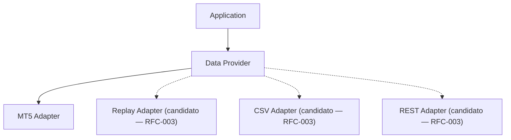

# Data Provider

Segunda entrega da Fase 2 — Platform Foundation. Detalha o componente `Data Provider`, já catalogado em `SPEC-001` (Infrastructure Providers) e já contratado em `SPEC-002` (Contrato: Data Provider). Este documento **não altera** `SPEC-001`, `SPEC-002`, `ARCH-001` ou qualquer ADR — apenas especifica, em nível de arquitetura, como o componente já existente é estruturado. Toda inconsistência encontrada foi registrada como RFC (ver "Rastreabilidade e Observações"), não incorporada silenciosamente.

---

# Objetivo

Definir oficialmente a arquitetura do componente `Data Provider`: como o sistema obtém dados de mercado sem acoplamento direto ao MT5.

`Data Provider` é uma abstração (Port). Nunca contém regras de negócio, nunca toma decisões, nunca calcula indicadores.

---

# Responsabilidades

`Data Provider` é responsável por fornecer, de forma bruta e sem interpretação:

- OHLC;
- Tick;
- Volume;
- Spread;
- Book (quando disponível na fonte);
- informações do símbolo;
- horário do servidor;
- Timeframe;
- informações de sessão (classificação temporal bruta, não avaliação de contexto de mercado).

---

# Não é Responsabilidade

`Data Provider` **não** realiza:

- cálculo de ATR;
- cálculo de RSI;
- cálculo de ADX;
- geração de Signal;
- geração de Opportunity;
- geração de Decision;
- aplicação de filtros;
- persistência de dados.

Cálculo de indicadores é responsabilidade do `Indicator Provider` (`SPEC-001`, detalhado em `INFRA-003`). Persistência é responsabilidade do `Persistence Provider`. Nenhuma dessas responsabilidades é assumida por `Data Provider`.

---

# Portas

Contratos públicos apenas — sem implementação, conforme `SPEC-002`.

| Porta | Entrada | Saída |
|---|---|---|
| `GetBars()` | Asset, Timeframe, Count/Range | Coleção de OHLC |
| `GetCurrentTick()` | Asset | Tick atual (Bid/Ask/Last/Volume/Timestamp) |
| `GetSpread()` | Asset | Spread atual |
| `GetSymbol()` | Asset | Informações do símbolo (dígitos, tamanho de contrato, etc.) |
| `GetTime()` | — | Horário do servidor |
| `GetSession()` | Timestamp | Classificação temporal bruta (ex.: janela horária ativa) |
| `GetMarketStatus()` | Asset | Status técnico do mercado (aberto/fechado/em leilão) |

**Nota de nomenclatura**: o brief de origem desta entrega solicitava uma porta `GetMarketState()`. Esse nome foi ajustado para `GetMarketStatus()` nesta especificação porque `DOMAIN-002` (Regras de Linguagem) proíbe explicitamente o termo **"Market State"** em favor de **"Market Context"** em todo o projeto. Como `Data Provider` nunca produz `Market Context` (isso é responsabilidade do Core Domain via `Market Context Builder`), manter um nome que ecoa o termo banido criaria ambiguidade terminológica direta com a Ubiquitous Language. Esta é uma correção documental de vocabulário, sem impacto arquitetural (nenhum componente, contrato aprovado ou ADR foi alterado) — não uma decisão que exija RFC.

Todas as demais portas usam os nomes exatamente como solicitados no brief.

---

# Dependências

## Permitidas

- `MT5 Adapter` (catalogado em `SPEC-001` como Execution Component — ver observação de categorização abaixo, já sinalizada em `INFRA-001`).
- Adapters alternativos de fonte de dados (Replay, Mock, CSV, REST, FIX, WebSocket) — **nenhum catalogado em `SPEC-001` hoje**; tratados como candidatos, não como dependências aprovadas (ver RFC-003).

## Proibidas

- Core Domain;
- Execution;
- Decision;
- Opportunity.

Consistente com `ARCH-001` ("O domínio não depende de infraestrutura" — e, simetricamente, Infrastructure nunca depende do domínio) e com `INFRA-001` ("Dependências Proibidas": Infrastructure → Core Domain).

---

# Extensibilidade

A arquitetura do `Data Provider` deve permitir múltiplas fontes de dados — MT5, Replay, Backtest, CSV, REST API, FIX, WebSocket — **sem exigir alteração dos consumidores** (`Indicator Provider`, `Evidence Builder`, conforme `SPEC-002`).

Isso é alcançado por `Data Provider` ser exclusivamente um Port: qualquer fonte concreta implementa o mesmo contrato (tabela de Portas acima) através de um Adapter próprio. Nenhum desses Adapters concretos é criado nesta entrega — apenas o Port é especificado.

---

# Qualidade

Requisitos mínimos aplicáveis a qualquer implementação de `Data Provider`:

- **Thread-safe quando aplicável**;
- **Stateless** — nenhuma regra de negócio ou estado de domínio armazenado entre chamadas;
- **Cache opcional** — implementação pode cachear para reduzir chamadas à fonte, sem alterar a saída esperada pelo contrato;
- **Timeout** — toda chamada a uma fonte externa deve respeitar um limite de tempo configurável (`Configuration Provider`);
- **Tratamento de falhas** — falhas da fonte nunca devem propagar exceções não tratadas ao consumidor;
- **Disponibilidade** — o Port deve expor uma forma de consulta de disponibilidade da fonte;
- **Observabilidade** — toda falha, reconexão ou timeout deve ser registrado via `Logger`.

---

# Diagrama

Linhas sólidas representam dependências já catalogadas (`MT5 Adapter`, `SPEC-001`). Linhas tracejadas representam adapters candidatos, ainda não registrados no Canonical Component Catalog (ver RFC-003).

---

# Casos de Uso

Descrição arquitetural apenas — sem algoritmo ou código.

## Inicialização

`Data Provider` é inicializado com uma referência ao Adapter concreto configurado (`Configuration Provider`). Nenhuma conexão é obrigatória neste momento; a conexão pode ser lazy.

## Solicitação de barras

O consumidor chama `GetBars(Asset, Timeframe, Count/Range)`. O Adapter concreto traduz a chamada para a fonte real e retorna a coleção de OHLC, ou uma falha tratada.

## Solicitação de Tick

O consumidor chama `GetCurrentTick(Asset)`. Retorna o tick mais recente disponível na fonte, ou uma falha tratada se indisponível.

## Falha do provedor

Qualquer falha de comunicação com a fonte deve ser capturada pelo Adapter, registrada via `Logger`, e retornada ao consumidor como um resultado de falha explícito — nunca como exceção não tratada, nunca como dado parcial silencioso.

## Reconexão

Ao detectar perda de conexão, o Adapter deve tentar reconexão respeitando o Timeout configurado, sem bloquear indefinidamente o consumidor.

## Troca de símbolo

O consumidor pode solicitar dados de um novo `Asset` a qualquer momento; `Data Provider` não mantém estado de "símbolo atual" (Stateless) — cada chamada é independente.

## Troca de timeframe

Da mesma forma, não há estado de "timeframe atual"; cada chamada especifica o `Timeframe` desejado explicitamente.

---

# Futura Evolução

A arquitetura do `Data Provider` deve permanecer compatível com futura integração de:

- Learning Engine;
- Replay Engine;
- Simulation Engine;
- Optimization Engine.

Nenhum destes é implementado nesta entrega. Nenhum consta no Canonical Component Catalog (`SPEC-001`) — são citados exclusivamente como possíveis consumidores/fontes futuras, seguindo o mesmo tratamento já dado a "Learning Engine, Knowledge Repository, Performance Analyzer, Recommendation Engine" em `INFRA-001` (Princípio de Evolução): compatibilidade arquitetural via Ports & Adapters, sem RFC nesta etapa, por não serem apresentados como componentes ou dependências atuais.

---

# Definition of Ready

O que precisa existir antes da implementação do `Data Provider`:

- Contrato de `Data Provider` aprovado (este documento) e `SPEC-002` (contrato já existente, não alterado).
- `Configuration Provider` disponível para fornecer parâmetros de conexão/timeout.
- `Logger` disponível para registrar falhas e reconexões.
- Decisão de qual Adapter concreto será implementado primeiro (recomendado: `MT5 Adapter`, já catalogado em `SPEC-001`).
- Nenhuma dependência de `Core Domain` introduzida no design da implementação.

---

# Definition of Done

Como saber que o componente está completo:

- Todas as portas da tabela "Portas" implementadas contra ao menos um Adapter concreto (`MT5 Adapter`).
- Compilação limpa verificada via MetaEditor CLI (0 erros/0 avisos), conforme `ADR-004`.
- Nenhuma dependência de `Core Domain`, `Execution`, `Decision` ou `Opportunity` presente na implementação.
- Comportamento Stateless verificado (troca de símbolo/timeframe sem estado residual).
- Tratamento de falha e timeout cobrindo ao menos: fonte indisponível, timeout de conexão, dado ausente.
- Nível de validação apropriado atingido conforme o pipeline do `ADR-004` (mínimo: Static Analysis + Compilation).
- `CHANGELOG.md`, `DOCUMENT_INDEX.md` e `TRACEABILITY.md` atualizados.

---

# Rastreabilidade e Observações

- `ARCH-001` (dependências permitidas/proibidas para Infrastructure).
- `SPEC-001` (Data Provider catalogado em Infrastructure Providers; MT5 Adapter catalogado em Execution Components).
- `SPEC-002` (Contrato: Data Provider já existente — Entrada Asset/Timeframe/Timestamp, Saída Market Data Snapshot, Consumidores Indicator Provider/Evidence Builder).
- `INFRA-001` (visão geral da camada Infrastructure; este documento é seu detalhamento para Data Provider).
- `ADR-007` (Architecture Baseline v1.0 Freeze — nenhum documento congelado foi alterado nesta entrega).

**Observação de categorização (já sinalizada em INFRA-001)**: `MT5 Adapter` é catalogado em `SPEC-001` como Execution Component, não Infrastructure Provider. Sua citação aqui como dependência permitida do `Data Provider` reflete o mesmo tratamento já dado em `INFRA-001` — não é uma reclassificação.

**Observação — RFC obrigatória**: `Replay Adapter`, `CSV Provider`/`CSV Adapter`, `Mock Provider`, `REST Adapter`, `FIX Adapter` e `WebSocket Adapter`, mencionados no brief desta entrega (seções "Dependências", "Extensibilidade" e "Diagrama"), **não constam no Canonical Component Catalog (`SPEC-001`)**. Conforme a regra de Canonical Naming (`AGENTS.md`) e o congelamento da Baseline (`ADR-007`), nenhum foi incorporado como componente ou dependência aprovada. Foram registrados em `Docs/10-rfc/RFC-003-Data-Provider-Candidate-Adapters.md`, classificados "Requires Architectural Decision".

---

# Próxima Entrega

`INFRA-003 — Indicator Provider`, conforme roadmap da Fase 2.
