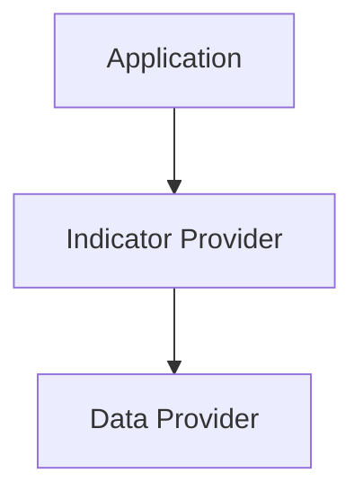

# Indicator Provider

Terceira entrega da Fase 2 — Platform Foundation. Detalha o componente `Indicator Provider`, já catalogado em `SPEC-001` (Infrastructure Providers) e já contratado em `SPEC-002` (Contrato: Indicator Provider). Este documento **não altera** `SPEC-001`, `SPEC-002`, `SPEC-003`, `ARCH-001` ou qualquer ADR — apenas especifica, em nível de arquitetura, como o componente já existente é estruturado.

## Validação Prévia (Document Validation Pipeline)

Executada antes da redação, conforme `AGENTS.md`:

- **DOMAIN-002**: nenhum termo novo introduzido; nenhuma alteração semântica.
- **ARCH-001**: `Indicator Provider` pertence à camada Infrastructure; dependências permitidas/proibidas aplicadas sem exceção.
- **SPEC-001**: `Indicator Provider` já existe no Canonical Component Catalog (Infrastructure Providers). Todos os indicadores citados no brief (ATR, RSI, ADX, EMA, SMA, MACD, Bollinger, VWAP) são **valores produzidos** por este único componente — não são componentes novos, e nenhum foi criado aqui.
- **SPEC-002**: contrato "Indicator Provider" já existente (Entrada: Market Data Snapshot; Saída: Indicator Values; Consumidor: Evidence Builder) — preservado sem alteração.
- **SPEC-003**: identificada uma ambiguidade de mapeamento pré-existente (ver "Rastreabilidade e Observações" — RFC-004), não introduzida por este documento.
- **TRACEABILITY**: `Indicator Provider` já rastreado como `Implemented` (informal) no `Component Lifecycle` do SPEC-001.

Nenhum componente solicitado no brief estava ausente de `SPEC-001` — portanto, diferente de `INFRA-001`/`INFRA-002`, nenhuma RFC de "componente candidato" foi necessária nesta entrega.

---

# Objetivo

Definir oficialmente o componente `Indicator Provider`: responsável exclusivamente por fornecer indicadores técnicos padronizados. Não interpreta indicadores, não aplica regras de negócio, não gera decisões.

---

# Responsabilidades

- Fornecer ATR;
- Fornecer RSI;
- Fornecer ADX;
- Fornecer EMA;
- Fornecer SMA;
- Fornecer MACD;
- Fornecer Bollinger;
- Fornecer VWAP (quando existir);
- fornecer indicadores futuros através da mesma abstração (ver "Extensibilidade").

---

# Não Responsabilidades

`Indicator Provider` nunca:

- interpreta indicador;
- define tendência;
- gera Opportunity;
- gera Decision;
- gera Signal;
- persiste indicadores;
- consulta Broker diretamente;
- consulta MT5 diretamente.

Interpretação (tendência, força, confiança) é responsabilidade do Core Domain (`Evidence Builder`, Domain Services — `SPEC-001`/`SPEC-003`), nunca de `Indicator Provider`.

---

# Fonte dos Dados

`Indicator Provider` somente pode consumir dados do `Data Provider` (`INFRA-002`).

É proibido acessar diretamente: MT5, CSV, Replay, REST, Broker, Banco de dados — mesmo que uma dessas fontes já esteja disponível através de um Adapter concreto do `Data Provider`. Todo dado bruto passa exclusivamente pelo Port `Data Provider`.

---

# Padrão dos Resultados

Contrato conceitual apenas — sem estrutura de código. Todo indicador retornado por `Indicator Provider` deve seguir um modelo uniforme contendo:

| Campo | Descrição |
|---|---|
| Valor | Resultado numérico (ou categórico, quando aplicável) do indicador |
| Timestamp | Momento a que o valor se refere |
| Timeframe | Período utilizado no cálculo |
| Símbolo | Ativo a que o valor se refere |
| Status | Válido / Inválido / Insuficiente / Indisponível |
| Origem | Fonte de dados subjacente utilizada (via `Data Provider`) |
| Qualidade dos dados | Indicação de confiabilidade do dado de origem (ex.: completo, parcial, atrasado) |

---

# Portas

Contratos conceituais, sem implementação:

| Porta | Entrada | Saída |
|---|---|---|
| `GetATR()` | Símbolo, Timeframe, Período | Resultado padronizado (ver "Padrão dos Resultados") |
| `GetRSI()` | Símbolo, Timeframe, Período | Resultado padronizado |
| `GetADX()` | Símbolo, Timeframe, Período | Resultado padronizado |
| `GetEMA()` | Símbolo, Timeframe, Período | Resultado padronizado |
| `GetSMA()` | Símbolo, Timeframe, Período | Resultado padronizado |
| `GetMACD()` | Símbolo, Timeframe, Parâmetros (rápida/lenta/sinal) | Resultado padronizado |
| `Health()` | — | Status operacional do provider |
| `Capabilities()` | — | Lista de indicadores atualmente suportados pela implementação ativa |

`Health()` e `Capabilities()` existem para suportar a extensibilidade (ver abaixo) sem que o consumidor precise conhecer antecipadamente quais indicadores uma implementação concreta suporta.

---

# Dependências

## Permitidas

- `Data Provider` (`INFRA-002`);
- `Configuration Provider` (`SPEC-001`);
- `Logger` (`SPEC-001`);
- `Time Provider` (`SPEC-001`).

## Proibidas

- Core Domain;
- Execution;
- Decision;
- Opportunity;
- Signal;
- Broker Adapter.

Todas já canônicas em `SPEC-001`; nenhuma dependência nova foi criada.

---

# Requisitos Não Funcionais

- **Determinismo** — mesma entrada (símbolo/timeframe/período/dados de origem) deve sempre produzir o mesmo valor.
- **Stateless** — nenhum estado de negócio armazenado entre chamadas.
- **Baixa latência** — cálculo não deve introduzir atraso perceptível ao pipeline de análise.
- **Cache configurável** — implementação pode cachear resultados por símbolo/timeframe/período, respeitando o `Timestamp` de origem.
- **Thread Safety** — chamadas concorrentes para símbolos/indicadores diferentes não podem interferir entre si.
- **Tratamento de falhas** — falha de cálculo ou de origem retorna Status explícito (`Inválido`/`Insuficiente`/`Indisponível`), nunca exceção não tratada.
- **Timeout** — toda chamada ao `Data Provider` subjacente respeita timeout configurável.
- **Observabilidade** — ver seção "Observabilidade".
- **Escalabilidade** — adicionar um novo indicador não deve exigir alteração dos consumidores existentes (ver "Extensibilidade").

---

# Padronização

- **Precisão / casas decimais**: cada indicador define sua própria precisão padrão (ex.: RSI/ADX em 2 casas decimais); a precisão é parte do contrato do indicador, não da chamada.
- **Arredondamento**: sempre por metade-para-cima (round-half-up), aplicado de forma consistente entre indicadores.
- **NaN**: nunca retornado ao consumidor — traduzido para Status `Inválido` ou `Insuficiente`.
- **Dados insuficientes**: quando o histórico disponível for menor que o lookback exigido pelo indicador, retornar Status `Insuficiente`, nunca um valor calculado sobre janela parcial sem sinalização.
- **Lookback**: cada indicador declara seu lookback mínimo (ex.: EMA 200 exige histórico ≥ 200 barras); `Indicator Provider` deve validar isso antes de calcular.
- **Validação de parâmetros**: períodos, símbolos e timeframes inválidos são rejeitados antes da chamada ao `Data Provider`, retornando Status `Inválido`.
- **Consistência entre timeframes**: o mesmo indicador solicitado em timeframes diferentes deve usar exatamente a mesma fórmula e a mesma política de arredondamento — apenas a fonte de barras (via `Data Provider`) muda.

---

# Extensibilidade

O mecanismo de extensão para indicadores futuros é o próprio Port `Indicator Provider`: qualquer novo indicador é exposto como uma nova porta (`GetXxx()`) seguindo o mesmo "Padrão dos Resultados", consumindo exclusivamente o `Data Provider`, sem exigir alteração dos consumidores existentes (`Evidence Builder` continua consumindo através do mesmo contrato de `SPEC-002`).

`Capabilities()` permite que o consumidor descubra em tempo de execução quais indicadores a implementação ativa suporta, sem acoplamento a uma lista fixa.

Nenhum componente novo é adicionado nesta entrega — apenas o mecanismo de extensão é definido.

---

# Diagrama

---

# Casos de Uso

Descrição arquitetural apenas — sem algoritmo ou código.

## Inicialização

`Indicator Provider` é inicializado com uma referência ao `Data Provider` configurado. Nenhum indicador é pré-calculado neste momento.

## Solicitação simples

O consumidor chama uma porta única (ex.: `GetRSI(Símbolo, Timeframe, Período)`). `Indicator Provider` valida parâmetros, solicita as barras necessárias ao `Data Provider`, calcula e retorna o resultado padronizado.

## Solicitação múltipla

O consumidor solicita vários indicadores para o mesmo símbolo/timeframe. `Indicator Provider` pode otimizar reaproveitando as barras já obtidas do `Data Provider` na mesma janela, sem alterar o contrato de cada porta individual.

## Dados insuficientes

Quando o histórico disponível é menor que o lookback exigido, `Indicator Provider` retorna Status `Insuficiente`, nunca um valor parcial não sinalizado.

## Erro do Data Provider

Se o `Data Provider` retornar falha, `Indicator Provider` propaga Status `Indisponível` ao consumidor, registrando via `Logger`, nunca uma exceção não tratada.

## Troca de símbolo

Como `Indicator Provider` é Stateless, cada chamada especifica o símbolo desejado explicitamente — não há "símbolo atual" mantido internamente.

## Troca de timeframe

Da mesma forma, cada chamada especifica o timeframe desejado; não há estado de "timeframe atual".

---

# Observabilidade

Métricas mínimas a expor:

- Tempo médio de cálculo por indicador;
- Tempo máximo de cálculo por indicador;
- Quantidade de indicadores inválidos retornados (Status `Inválido`/`Insuficiente`);
- Quantidade de erros (Status `Indisponível`);
- Cache Hit;
- Cache Miss.

---

# Definition of Ready

O que precisa existir antes da implementação do `Indicator Provider`:

- `Data Provider` (`INFRA-002`) implementado e disponível (ao menos um Adapter concreto funcional).
- `Configuration Provider` disponível para parâmetros padrão de cada indicador (períodos default, precisão).
- `Logger` disponível para registrar falhas e dados insuficientes.
- `Time Provider` disponível, quando o cálculo depender de referência de tempo além do `Timestamp` das barras.
- Lista inicial de indicadores a implementar definida (ATR, RSI, ADX, EMA, SMA, MACD — conforme "Responsabilidades").

---

# Definition of Done

Como validar que o componente está concluído:

- Todas as portas da tabela "Portas" implementadas e retornando o "Padrão dos Resultados" uniforme.
- Nenhuma dependência de Core Domain, Execution, Decision, Opportunity, Signal ou Broker Adapter presente na implementação.
- Comportamento Stateless verificado (troca de símbolo/timeframe sem estado residual).
- Regras de "Padronização" (NaN, dados insuficientes, lookback, arredondamento) verificadas para cada indicador.
- Compilação limpa verificada via MetaEditor CLI (0 erros/0 avisos), conforme `ADR-004`.
- Métricas de "Observabilidade" disponíveis.
- `CHANGELOG.md`, `DOCUMENT_INDEX.md` e `TRACEABILITY.md` atualizados.

---

# Critérios de Teste

Critérios mínimos, seguindo o pipeline de validação do `ADR-004` (não testes unitários obrigatórios, dado que MQL5 não possui framework equivalente):

- **Precisão**: valor calculado deve reproduzir, dentro da precisão declarada, o valor de referência conhecido (ex.: reconstrução manual de RSI/ATR a partir de OHLC, como já praticado no RC1 da V1 — ver `Docs/BACKLOG.md`).
- **Consistência**: mesmo indicador solicitado duas vezes com os mesmos parâmetros e mesma origem de dados deve retornar o mesmo valor (Determinismo).
- **Performance**: tempo de cálculo dentro do limite definido em "Requisitos Não Funcionais" (baixa latência), medido via métricas de "Observabilidade".
- **Reprodutibilidade**: o mesmo indicador, no mesmo símbolo/timeframe, calculado em execuções diferentes do terminal, deve produzir o mesmo resultado para o mesmo intervalo de dados histórico.

---

# Rastreabilidade e Observações

- `ARCH-001` (dependências permitidas/proibidas para Infrastructure).
- `SPEC-001` (`Indicator Provider` catalogado em Infrastructure Providers; `Data Provider`, `Configuration Provider`, `Logger`, `Time Provider` idem).
- `SPEC-002` (Contrato: Indicator Provider já existente — Entrada Market Data Snapshot, Saída Indicator Values, Consumidor Evidence Builder).
- `INFRA-001` (visão geral da camada Infrastructure).
- `INFRA-002` (Data Provider — única fonte de dados permitida para este componente).

**Observação — inconsistência identificada na Validação Prévia (não introduzida por este documento)**: `SPEC-001` (Component Lifecycle) atribui `TrendService`, `ATRService`, `RSIService` e `ADXService` (Legacy Baseline) ao papel de **`Indicator Provider`** ("cada serviço chama iMA/iRSI/iATR/iADX diretamente, sem abstração separada"). Já `SPEC-003` (Legacy Baseline, seção final) afirma que os mesmos quatro serviços "correspondem a **Evidence Builder** — ver SPEC-001, não Domain Service" — atribuindo-os a um componente diferente (`Evidence Builder`, Core Domain Builder, não Infrastructure Provider). Ambos os documentos pertencem à Baseline congelada (`ADR-007`) e não puderam ser alterados para resolver a divergência. Registrada em `Docs/10-rfc/RFC-004-Legacy-Indicator-Mapping-Ambiguity.md`, classificada "Requires Architectural Decision" — este documento (`INFRA-003`) segue o mapeamento de `SPEC-001` (Indicator Provider) por ser o Canonical Component Catalog, mas a divergência com `SPEC-003` permanece sem resolução até decisão via ADR/RFC aprovada.

---

# Próxima Entrega

`INFRA-004 — Configuration Provider`, conforme roadmap da Fase 2.
